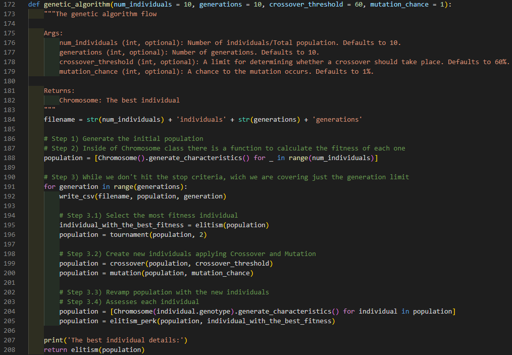
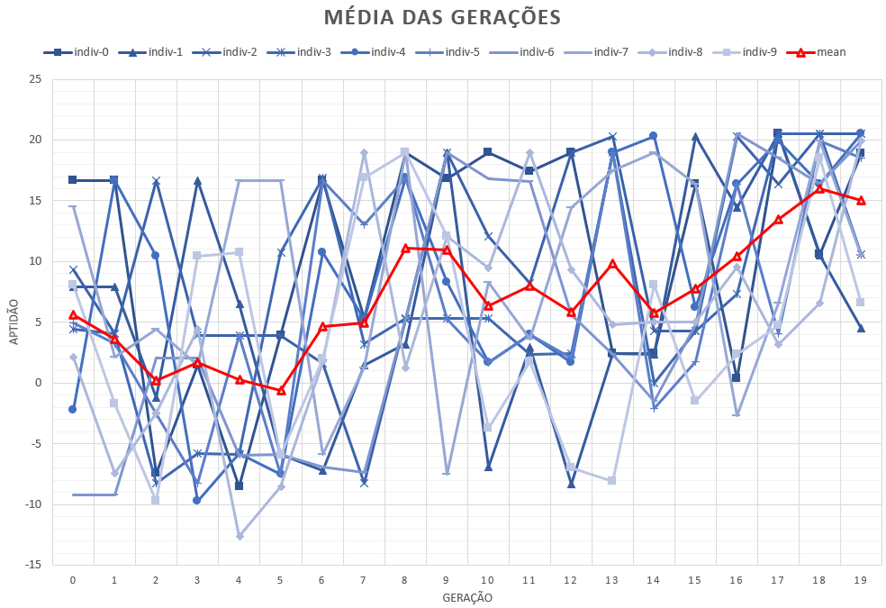

# Inteligência Artificial - Trabalho 02: Algoritmos Genéticos

#### Membros
Hellesandro Gonzaga de Carvalho (20161BSI0390)
Renato da Silva Bellumat (20151BSI0312)

### Especificação:
- Implementação de um Algoritmo Genético de acordo com as especificações do pdf: [Trabalho 2](https://github.com/gonzH/ifes-ia-ag/blob/master/materiais/Especificacao_trab2_AG.pdf)
- Apostila: [Apostila reduzida](https://github.com/gonzH/ifes-ia-ag/blob/master/materiais/AGapostila_reduzida.pdf)


## Relatório - Implementação do AG

### Conceito

O desenvolvimento e pesquisas de simulações computacionais de sistemas genéticos teve início nos anos 50 e 60 através de muitos biólogos e principalmente por John Holland que publicou "*Adaptation in Natual and Artificial Systems*".

[...]

A idéia básica de funcionamento dos algoritmos genéticos é a de tratar as possíveis soluções do problema como "indivíduos" de uma "população", que irá "evoluir" a cada iteração ou "geração". Para isso é necessário construir um modelo de evolução onde os indivíduos sejam soluções de um problema. A execução do algoritmo pode ser resumida nos seguintes passos:

- Inicialmente escolhe-se uma população inicial, normalmente formada por
indivíduos criados aleatoriamente;
- Avalia-se toda a população de indivíduos segundo algum critério, determinado por uma função que avalia a qualidade do indivíduo (função de aptidão ou
"fitness");
- Em seguida, através do operador de "seleção", escolhem-se os indivíduos de melhor valor (dado pela função de aptidão) como base para a criação de um novo conjunto de possíveis soluções, chamado de nova "geração";
- Esta nova geração é obtida aplicando-se sobre os indivíduos selecionados operações que misturem suas características (chamadas "genes"), através dos operadores de "cruzamento" ("crossover") e "mutação";
- Estes passos são repetidos até que uma solução aceitável seja encontrada, até que o número predeterminado de passos seja atingido ou até que o algoritmo não consiga mais melhorar a solução já encontrada. 


### Problema

O problema proposto é a minimização da função:


<br>

### Implementação

Seguindo a lógica citada em Conceito mas também alinhando com as especificações do trabalho, definimos a função abaixo:

<br>

Ela controla o fluxo principal do algoritmo genético fazendo as chamadas em sequência. Sendo assim:

- Geramos a população inicial e já calculamos a aptidão de cada indivíduo na `linha 188`.
    - A classe Chromosome possui métodos para gerar o genótipo, fenótipo e calcular aptidão, respectivamente `generate_genotype`, `generate_fenotype`, `calculate_fitness` são chamadas pelo método `generate_characteristcs`.
- Enquanto a condição de parada não seja satisfeita o processo evolutivo continua, apenas a condição de limite de gerações foi implementada `linha 191`
- Selecionamos o melhor indivíduo da geração com base na aptidão e salvamos na `linha 195`, em seguida um torneio acontece `linha 196`, no torneio são geradas "chaves aleatórias de confrontos" onde naturalmente, o melhor vence, porém, para cada confronto o competidor mais forte tem 75% de vencer.
- Criamos novos indivíduos através do Cruzamento `linha 199` e Mutação `linha 200`.
    - O Cruzamento tem por padrão 60% de chance de acontecer. Quando um cruzamento acontece, 2 indivíduos pais são escolhidos e tem seu genótipo fatiado em uma posição aleatória de forma uniforme, então são gerados um filho de cada pai, cada filho possui o genótipo de seu respectivo pai do index 0 até o ponto de fatiamento, desse ponto em diante as fatias dos pais são trocadas entre os filhos.
    - A Mutação tem por padrão 1% de chance de acontecer. Nesse processo, para cada gene do genótipo de cada um dos indíviduos da população, há a chance de 1% desse gene avaliado ser mutado para o valor inverso.
- Então renovamos a população com os indivíduos modificados nas etapas anteriores e novamente avaliamos cada indivíduo. Ambos processos são realizdos na `linha 204`
- Antes de finalizar a geração atual, substituímos o pior indivíduo da população atual pelo melhor indivíduo da população inicial da geração atual. `linha 205`
- A próxima geração é iniciada caso a condição de parada não foi satisfeita


### Resultados
O algoritmo gera dois arquivos `.csv`, um para 10 gerações e outro para 20 gerações, sendo uma população de 10 indivíduos para ambos.

##### 10 Gerações
Com 10 gerações podemos observar através da média uma pequena aleatoriedade no na primeira metade de gerações e adiante uma tendência de estabilização dos valores. De qualquer forma, no exemplo abaixo, podemos ver o indivíduo 2 atingindo aptidão 20 em quase todas as gerações a partir da terceira geração.


##### 20 Gerações
Com 20 gerações foi observado bastante variação da média mas novamente nas últimas gerações podemos perceber um crescimento positivo de aptidão, a partir da geração 14 nenhum indivíduo atingiu aptidão menor que -3.




### Como rodar
Tendo **Python 3.7** instalado, execute o arquivo `main.py` no terminal. Como? Dependendo de como o Python foi instalado no seu computador você pode:
- Abrir o terminal na pasta do código e digitar ```python main.py``` se `python` foi a variável de ambiente listada para o interpretador.
###### OU
- Abrir o código fonte `main.py` numa IDE e executar.


### Saída
Se o código executou corretamente, ele deve printar os atributos do melhor indivíduo da última geração e gerar um arquivo `.csv` para cada chamda da função `genetic_algorithm`.
